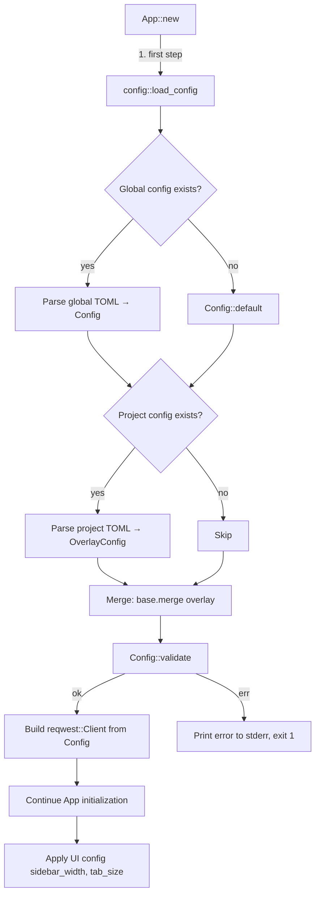

# feat: Add Layered TOML Configuration File System

## Overview

Add a layered TOML configuration system to Perseus that replaces hardcoded defaults with user-configurable settings. The system supports two tiers — global config at `$XDG_CONFIG_HOME/perseus/config.toml` and project-level overrides at `.perseus/config.toml` — with field-level merging. This is the foundational infrastructure that multiple Phase 1+ features (proxy, SSL, redirects, history, auth) depend on.

## Problem Statement

Perseus currently hardcodes all configuration values:

| Setting | Location | Current Value |
|---------|----------|---------------|
| HTTP timeout | `app.rs:496` | `Duration::from_secs(30)` |
| Sidebar width default | `app.rs:521` | `32` |
| Sidebar width range | `app.rs:2661-2663` | `28..=42` |
| Follow redirects | Not configured | reqwest default (10 max) |
| SSL verification | Not configured | reqwest default (enabled) |
| Proxy | Not configured | reqwest default (system) |

Users cannot customize HTTP behavior (timeouts, redirects, proxy, SSL), UI defaults (sidebar width, tab size), or prepare for upcoming features (history limits). Corporate environments that require proxy or custom CA certificates cannot use Perseus without code changes.

## Proposed Solution

A new `src/config.rs` module that:
1. Defines a `Config` struct with serde-derived TOML deserialization
2. Resolves global and project config paths using XDG conventions (matching existing `session_state.rs` pattern)
3. Merges configs field-by-field (project overrides global, both override defaults)
4. Validates value ranges and file path existence
5. Feeds settings into `reqwest::Client::builder()` and UI initialization

## Technical Approach

### Architecture

```
┌─────────────────────────────────────────────────────┐
│                    App::new()                        │
│                                                      │
│  1. config::load_config()                            │
│     ├── resolve global path ($XDG_CONFIG_HOME)       │
│     ├── resolve project path (.perseus/)             │
│     ├── parse & merge TOML files                     │
│     └── validate all values                          │
│                                                      │
│  2. Client::builder()                                │
│     ├── .timeout(config.http.timeout)                │
│     ├── .redirect(config.http.redirect_policy())     │
│     ├── .proxy(config.proxy...)                      │
│     └── .tls(config.ssl...)                          │
│                                                      │
│  3. UI initialization                                │
│     ├── sidebar_width from config (default)          │
│     └── tab_size from config                         │
└─────────────────────────────────────────────────────┘
```

### Config Struct Design

```rust
// src/config.rs

use std::path::PathBuf;
use serde::Deserialize;

/// Top-level config — all fields optional with defaults.
/// Unknown keys silently ignored for forward compatibility.
#[derive(Debug, Clone, Deserialize)]
#[serde(default)]
pub struct Config {
    pub http: HttpConfig,
    pub proxy: ProxyConfig,
    pub ssl: SslConfig,
    pub ui: UiConfig,
    pub editor: EditorConfig,
}

#[derive(Debug, Clone, Deserialize)]
#[serde(default)]
pub struct HttpConfig {
    /// Timeout in seconds. 0 = no timeout.
    pub timeout: u64,         // default: 30
    pub follow_redirects: bool, // default: true
    pub max_redirects: u32,   // default: 10
}

#[derive(Debug, Clone, Deserialize)]
#[serde(default)]
pub struct ProxyConfig {
    pub url: Option<String>,      // must be valid URL if present
    pub no_proxy: Option<String>, // comma-separated hostnames
}

#[derive(Debug, Clone, Deserialize)]
#[serde(default)]
pub struct SslConfig {
    pub verify: bool,                  // default: true
    pub ca_cert: Option<PathBuf>,      // must exist if specified
    pub client_cert: Option<PathBuf>,  // must exist if specified (PEM)
    pub client_key: Option<PathBuf>,   // must exist if specified (PEM)
}

#[derive(Debug, Clone, Deserialize)]
#[serde(default)]
pub struct UiConfig {
    pub sidebar_width: u16, // default: 32, range: 28..=60
}

#[derive(Debug, Clone, Deserialize)]
#[serde(default)]
pub struct EditorConfig {
    pub tab_size: u8, // default: 2, range: 1..=8
}
```

### Config File Format

```toml
# ~/.config/perseus/config.toml

[http]
timeout = 30              # seconds, 0 = no timeout
follow_redirects = true
max_redirects = 10

[proxy]
# url = "http://proxy.corp:8080"
# no_proxy = "localhost,127.0.0.1,.internal"

[ssl]
verify = true
# ca_cert = "/path/to/ca.pem"
# client_cert = "/path/to/client.pem"
# client_key = "/path/to/client-key.pem"

[ui]
sidebar_width = 32

[editor]
tab_size = 2
```

### Layered Resolution

```
Defaults (hardcoded in Config::default())
    ↓ overridden by
Global config ($XDG_CONFIG_HOME/perseus/config.toml)
    ↓ overridden by
Project config ({project_root}/.perseus/config.toml)
    ↓ overridden by (future)
Per-request overrides
```

**Merge strategy: field-level.** If global sets `[proxy]` with `url` and `no_proxy`, and project sets `[proxy]` with only `url`, the global `no_proxy` survives. This is implemented by deserializing each layer into an `OverlayConfig` with `Option<T>` fields, then merging `Some` values over the base.

```rust
/// Overlay config for partial deserialization (project-level overrides).
/// All fields are Option — None means "inherit from the layer below."
#[derive(Debug, Clone, Deserialize, Default)]
#[serde(default)]
pub struct OverlayConfig {
    pub http: OverlayHttpConfig,
    pub proxy: OverlayProxyConfig,
    pub ssl: OverlaySslConfig,
    pub ui: OverlayUiConfig,
    pub editor: OverlayEditorConfig,
}

#[derive(Debug, Clone, Deserialize, Default)]
#[serde(default)]
pub struct OverlayHttpConfig {
    pub timeout: Option<u64>,
    pub follow_redirects: Option<bool>,
    pub max_redirects: Option<u32>,
}

// ... same pattern for other sub-configs ...

impl Config {
    /// Apply overlay values over self. Only Some fields are overridden.
    pub fn merge(mut self, overlay: OverlayConfig) -> Self {
        if let Some(v) = overlay.http.timeout { self.http.timeout = v; }
        if let Some(v) = overlay.http.follow_redirects { self.http.follow_redirects = v; }
        if let Some(v) = overlay.http.max_redirects { self.http.max_redirects = v; }
        // ... same for proxy, ssl, ui, editor fields ...
        self
    }
}
```

### Path Resolution

Following the existing XDG pattern from `session_state.rs:38-49`:

```
global_config_path():
  1. $XDG_CONFIG_HOME/perseus/config.toml  (if XDG_CONFIG_HOME is set and non-empty)
  2. $HOME/.config/perseus/config.toml     (fallback)
  3. None                                   (if HOME is unset — containerized environments)

project_config_path():
  1. find_project_root()/.perseus/config.toml  (reuses existing project.rs)
  2. None                                       (if no project root found)
```

Tilde expansion (`~`) is supported in path values (`ssl.ca_cert`, `ssl.client_cert`) by expanding `~` to `$HOME` before path resolution.

### Implementation Phases

#### Phase 1: Config Struct and Loading (Foundation)

**Goal:** Define the `Config` struct with defaults, load from TOML files, no integration yet.

**Tasks:**
- [x] Add `toml = "0.8"` to `Cargo.toml` dependencies
- [x] Create `src/config.rs` module
- [x] Define `Config`, `HttpConfig`, `ProxyConfig`, `SslConfig`, `UiConfig`, `EditorConfig` structs with `#[derive(Deserialize)]` and `#[serde(default)]`
- [x] Implement `Default` for each struct with the documented default values
- [x] Implement `global_config_path()` — XDG resolution matching `session_state.rs` pattern
- [x] Implement `project_config_path()` — reuse `find_project_root()` from `project.rs`
- [x] Implement `load_file(path) -> Result<Config>` — read file, parse TOML, return Config
- [x] Add `mod config;` to `main.rs`

**Verification:**
- Compiles with `cargo build`
- Unit test: `Config::default()` returns expected values
- Unit test: Parse a valid TOML string into `Config`
- Unit test: Missing file returns `Config::default()`

**Files touched:** `Cargo.toml`, `src/config.rs` (new), `src/main.rs`

#### Phase 2: Config Merging

**Goal:** Implement field-level merging of global + project configs.

**Tasks:**
- [x] Define `OverlayConfig` — mirrors `Config` but with all fields wrapped in `Option<T>`
- [x] Implement `OverlayConfig` deserialization from TOML (allows partial configs)
- [x] Implement `Config::merge(self, overlay: OverlayConfig) -> Config` — apply `Some` values from overlay over base
- [x] Implement `load_config() -> Result<Config>` — loads global, loads project overlay, merges
- [x] Handle missing files gracefully (no global = all defaults, no project = global only)
- [x] Handle permission errors with clear error messages including file path

**Verification:**
- Unit test: Merge with empty overlay returns base unchanged
- Unit test: Merge with partial overlay overrides only specified fields
- Unit test: Project `[proxy].url` overrides global without wiping `proxy.no_proxy`
- Unit test: Both files missing returns defaults

**Files touched:** `src/config.rs`

#### Phase 3: Validation

**Goal:** Validate config values after merging, before use.

**Tasks:**
- [x] Implement `Config::validate(&self) -> Result<()>`
- [x] Validate value ranges:
  - `http.timeout`: `0..=600` (0 = no timeout, max 10 minutes)
  - `http.max_redirects`: `0..=100`
  - `ui.sidebar_width`: `28..=60` (lower bound matches current `clamp_sidebar_width`, upper bound relaxed from 42 to support wider terminals)
  - `editor.tab_size`: `1..=8`
- [x] Validate `proxy.url` is a parseable URL if `Some`
- [x] Validate `ssl.ca_cert` file exists if `Some` (with tilde expansion)
- [x] Validate `ssl.client_cert` file exists if `Some` (with tilde expansion)
- [x] Validate `ssl.client_key` file exists if `Some` (with tilde expansion)
- [x] Validate `ssl.client_cert` and `ssl.client_key` are either both set or both unset
- [x] Implement tilde expansion helper: replace leading `~` with `$HOME`
- [x] Produce clear error messages: `"config error: http.timeout = 999 is out of range (0..=600) in /path/to/config.toml"`

**Verification:**
- Unit test: Valid config passes validation
- Unit test: Out-of-range values produce descriptive errors
- Unit test: Non-existent cert path produces error with the path shown
- Unit test: Tilde expansion works (`~/certs/ca.pem` → `/Users/kevin/certs/ca.pem`)

**Files touched:** `src/config.rs`

#### Phase 4: Integration — HTTP Client

**Goal:** Wire config into `reqwest::Client::builder()` in `App::new()`.

**Tasks:**
- [x] Add `config: Config` field to `App` struct (`app.rs`)
- [x] Call `config::load_config()` as the first step in `App::new()`, before `Client::builder()`
- [x] Replace hardcoded `Duration::from_secs(30)` with `Duration::from_secs(config.http.timeout)`, or no timeout if `timeout == 0`
- [x] Set redirect policy: if `follow_redirects` is `true`, use `Policy::limited(max_redirects)`; if `false`, use `Policy::none()`
- [x] Set proxy if `proxy.url` is `Some`: build `reqwest::Proxy::all(url)`, then call `.no_proxy(reqwest::NoProxy::from_string(&no_proxy))` if `proxy.no_proxy` is set
- [x] Set SSL if `ssl.verify` is `false`: call `.danger_accept_invalid_certs(true)`
- [x] Set CA cert if `ssl.ca_cert` is `Some`: read file, call `.add_root_certificate()`
- [x] Set client identity if `ssl.client_cert` and `ssl.client_key` are both `Some`: read both PEM files, concatenate, build `reqwest::Identity::from_pem()`, call `.identity()`

**Verification:**
- `cargo build` succeeds
- Manual test: Run without any config file — behavior unchanged (30s timeout, redirects on)
- Manual test: Create config with `http.timeout = 5`, verify shorter timeout
- Manual test: Set `ssl.verify = false`, verify requests to HTTPS endpoints skip cert validation
- Manual test: Invalid config file produces clear error to stderr and non-zero exit

**Files touched:** `src/app.rs`, `src/config.rs` (minor — re-export or helper methods)

#### Phase 5: Integration — UI Settings

**Goal:** Wire UI config values into sidebar width and editor tab size.

**Tasks:**
- [x] Use `config.ui.sidebar_width` as the default sidebar width (replacing hardcoded `32`)
- [x] Respect existing session-persisted sidebar width as override (session state wins if present)
- [x] Apply `config.editor.tab_size` to all TextArea widgets via `set_tab_length()`
- [x] Update `clamp_sidebar_width()` range to use constants that could later come from config

**Verification:**
- Manual test: Set `ui.sidebar_width = 36` in config, verify sidebar starts at 36
- Manual test: Resize sidebar during session, restart — session width is preserved (not reset to config value)
- Manual test: Set `editor.tab_size = 4`, verify tab key inserts 4 spaces in body editor

**Files touched:** `src/app.rs`

#### Phase 6: Error Reporting and Polish

**Goal:** Ensure config errors are clear, actionable, and well-formatted.

**Tasks:**
- [x] Format TOML parse errors with file path, line, column, and expected syntax
- [x] Format validation errors with field name, current value, allowed range, and file path
- [x] Test error messages for all failure modes (invalid TOML, wrong types, out-of-range, missing certs, permission denied)
- [x] Add `Config` to `Debug` trait for future `--show-config` capability
- [x] Add a sample `config.toml` at `docs/sample-config.toml` with all keys commented out and defaults shown

**Verification:**
- Manual test: Introduce TOML syntax error, verify error message quality
- Manual test: Set `timeout = "fast"` (wrong type), verify error message quality
- Manual test: Set `sidebar_width = 999`, verify validation error
- Sample config parses successfully when uncommented

**Files touched:** `src/config.rs`, `docs/sample-config.toml` (new)

### ERD / Data Flow Diagram



## Alternative Approaches Considered

### 1. Use the `config` crate for layered config

The [`config`](https://crates.io/crates/config) crate provides built-in layered configuration with multiple sources (files, env vars, defaults). It handles merging automatically.

**Rejected because:**
- Adds a heavyweight dependency with many transitive deps (serde_yaml, json5, etc.)
- The merging behavior is opaque and harder to reason about
- Perseus only needs two layers (global + project) — manual merging is simple
- The existing codebase uses direct serde patterns, not configuration frameworks

### 2. JSON config instead of TOML

JSON is already used for Postman collections and session state.

**Rejected because:**
- JSON lacks comments — users cannot annotate their config
- TOML is the Rust ecosystem convention for CLI tool config (Cargo.toml, rustfmt.toml, etc.)
- TOML's `[section]` headers make settings grouping visually clear

### 3. YAML config

YAML is popular in DevOps and some API tools (Bruno uses it).

**Rejected because:**
- YAML parsing is more complex and error-prone (indentation-sensitive)
- Adds a heavier dependency (`serde_yaml`)
- TOML is the Rust ecosystem standard

### 4. Single config file (no layering)

Only support `~/.config/perseus/config.toml` with no project overrides.

**Rejected because:**
- Users working on multiple projects need different proxy, SSL, and timeout settings
- Project-level config enables team sharing (e.g., custom CA cert for staging)
- The brainstorm explicitly specified layering, and the existing storage already has a project-local tier

## Acceptance Criteria

### Functional Requirements

- [x] Perseus starts normally with no config files present (all defaults)
- [x] Global config at `$XDG_CONFIG_HOME/perseus/config.toml` (fallback `~/.config/perseus/config.toml`) is loaded and applied
- [x] Project config at `.perseus/config.toml` overrides global config values
- [x] Field-level merging: partial project config only overrides specified fields
- [x] `http.timeout` is applied to reqwest client (verified with a slow server or timeout=1)
- [x] `http.follow_redirects` and `http.max_redirects` control redirect behavior
- [x] `proxy.url` configures the HTTP proxy
- [x] `ssl.verify = false` disables certificate verification
- [x] `ssl.ca_cert` adds a custom CA certificate
- [x] `ssl.client_cert` + `ssl.client_key` enables mutual TLS (both required together)
- [x] `ui.sidebar_width` sets the default sidebar width
- [x] `editor.tab_size` controls tab insertion width in editors
- [x] Tilde (`~`) in file paths is expanded to `$HOME`

### Non-Functional Requirements

- [x] Invalid TOML produces a clear error to stderr with file path, line, and column
- [x] Invalid values produce errors naming the field, value, and allowed range
- [x] Missing cert/key files produce errors with the resolved path
- [x] Permission-denied errors include the file path
- [x] Config loading adds <1ms to startup (TOML parsing is fast)
- [x] Unknown keys are silently ignored (forward compatibility)

### Quality Gates

- [x] All config structs have unit tests for `Default` values
- [x] TOML parsing is tested with valid, partial, and invalid inputs
- [x] Merging is tested with all combinations (neither, global only, project only, both)
- [x] Validation is tested for each field's range boundaries
- [x] `cargo clippy` passes with no warnings
- [x] `cargo test` passes
- [x] Manual testing with no config, global only, project override scenarios

## Success Metrics

- Zero hardcoded values remain for configurable settings in `app.rs`
- Config integration in `app.rs` is thin (load + pass to builder, no parsing/validation logic)
- `src/config.rs` is self-contained (no dependencies on `app.rs` internals)
- No regressions in existing behavior when no config files present

## Dependencies & Prerequisites

**Internal:**
- No code dependencies — this is the first infrastructure feature
- Must complete before: Phase 1.2 (Auth), Phase 2.6 (History), Phase 3.1 (Proxy), Phase 3.2 (SSL), Phase 3.4 (Redirects/Timeout)

**External crates:**
- `toml = "0.8"` — TOML parsing with serde support

## Risk Analysis & Mitigation

| Risk | Likelihood | Impact | Mitigation |
|------|-----------|--------|------------|
| Config error prevents startup | Medium | High | Clear error messages with file path + line. No config = all defaults (never blocks startup) |
| Field-level merge logic bugs | Low | Medium | Comprehensive unit tests for all merge scenarios |
| SSL cert path expansion issues | Low | Medium | Test tilde expansion on macOS and Linux; validate paths exist before use |
| Breaking config schema in future | Low | High | Use `#[serde(default)]` on all fields; silently ignore unknown keys; commit to additive-only changes |
| `ui.sidebar_width` conflict with session state | Low | Low | Session-persisted width overrides config. Config sets the default for new sessions only |

## Resource Requirements

**New files:** 1 (`src/config.rs`)
**Modified files:** 3 (`Cargo.toml`, `src/main.rs`, `src/app.rs`)
**New dependencies:** 1 (`toml`)
**Estimated scope:** ~250-350 lines of new code across all phases

## Future Considerations

- **Config hot reload:** Currently config is loaded once at startup. A future `Ctrl+Shift+R` could reload config without restarting. This requires rebuilding `reqwest::Client` (its settings are immutable after construction).
- **`--config` CLI flag:** Override global config path for testing/debugging.
- **`--show-config` CLI flag:** Print the effective merged config for debugging.
- **Environment variable interpolation:** Allow `proxy.url = "${HTTP_PROXY}"` to read from env vars. Useful for CI and avoiding secrets in committed configs.
- **`--init-config` command:** Generate a sample config file at the global path with all keys commented out.
- **Config versioning:** If a breaking schema change is needed, add a `version` field (following the `SESSION_VERSION` pattern in `session_state.rs`).
- **`history.max_entries`:** Deferred to Phase 2.6 (History feature). The config struct can add this field when the feature is implemented, with no breaking change needed.
- **Visual indicator:** Show `[config]` or `[project config]` in the status bar when non-default config is active.

## Documentation Plan

- [x] `docs/sample-config.toml` — fully commented sample with all keys and defaults
- [x] Update project README with config file location and basic usage
- [x] Document layering behavior (global < project) in sample config comments

## References & Research

### Internal References

- HTTP client construction: `src/app.rs:494-498` (hardcoded 30s timeout)
- Sidebar width clamping: `src/app.rs:2661-2663` (range 28-42)
- XDG path resolution pattern: `src/storage/session_state.rs:38-49`
- Project root detection: `src/storage/project.rs:5-24`
- UI state persistence: `src/storage/ui_state.rs`
- Session state persistence: `src/storage/session_state.rs`
- Editor configuration: `src/app.rs:385-388` (`configure_editor()`)

### External References

- [TOML specification](https://toml.io/en/)
- [toml crate documentation](https://docs.rs/toml/latest/toml/)
- [XDG Base Directory Specification](https://specifications.freedesktop.org/basedir-spec/latest/)
- [reqwest ClientBuilder API](https://docs.rs/reqwest/latest/reqwest/struct.ClientBuilder.html)

### Related Work

- Brainstorm: `docs/brainstorms/2026-02-15-production-ready-features-brainstorm.md` (Section 1.1)
- Phase 1.1 in the brainstorm prioritizes config as the first feature because Phases 2-4 depend on config infrastructure

## Design Decisions Log

| Decision | Choice | Rationale |
|----------|--------|-----------|
| Unknown keys handling | Silently ignore | Forward compatibility — newer config files work with older Perseus versions |
| Invalid TOML behavior | Hard error, exit 1 | Silent degradation hides config mistakes; user thinks settings are applied when they aren't |
| Merge strategy | Field-level | Table-level replacement is too surprising (setting one proxy field would wipe others) |
| Timeout format | Integer seconds (u64) | Simple, unambiguous; 0 = no timeout; fractional seconds uncommon for HTTP |
| Cert path validation | Hard error if path doesn't exist | User configured certs intentionally; silently ignoring is a security risk |
| Session state vs config precedence | Session state wins for UI settings | User's manual resize during a session should persist; config provides the initial default |
| `history.max_entries` | Deferred to Phase 2.6 | No-op config keys are confusing; add when the feature exists |
| Config versioning | None in v1 | Commit to additive-only schema changes; add versioning only if a breaking change is needed |
| `$XDG_CONFIG_HOME` | Respected | Consistent with existing `$XDG_STATE_HOME` usage in `session_state.rs` |
| Tilde expansion | Supported for path fields | Common user expectation; `std::fs` doesn't expand `~` natively |
| Client cert + key | Separate `client_cert` and `client_key` fields, both required | Reqwest's `Identity::from_pem()` needs cert + key; separate fields match how certs are typically stored |
| Sidebar width range | `28..=60` | Lower bound preserved from existing `clamp_sidebar_width`; upper bound relaxed from 42 to support wider terminals |
